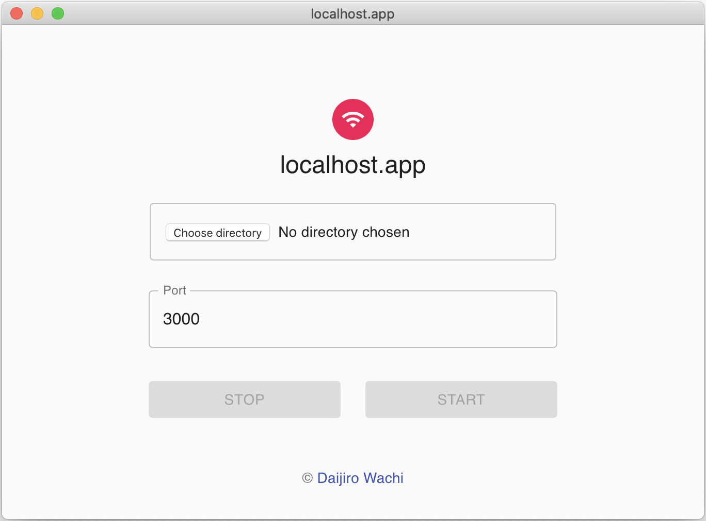

  
   
  <b>localhost.app</b>
   
  Simple file server app

## Usage

0. [Download the latest release](https://github.com/watilde/localhost-app/releases/latest) and launch the app

1. Choose directory which will be used as root
2. Set port number between 0 and 65535
3. Start local file server and open http://localhost:{your port number}
4. Stop the server
